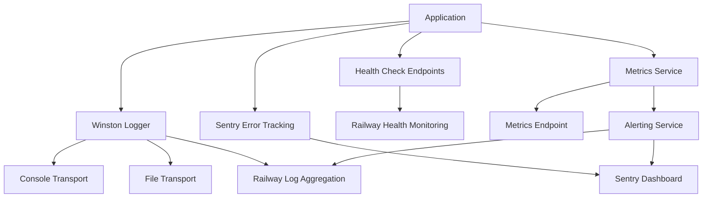
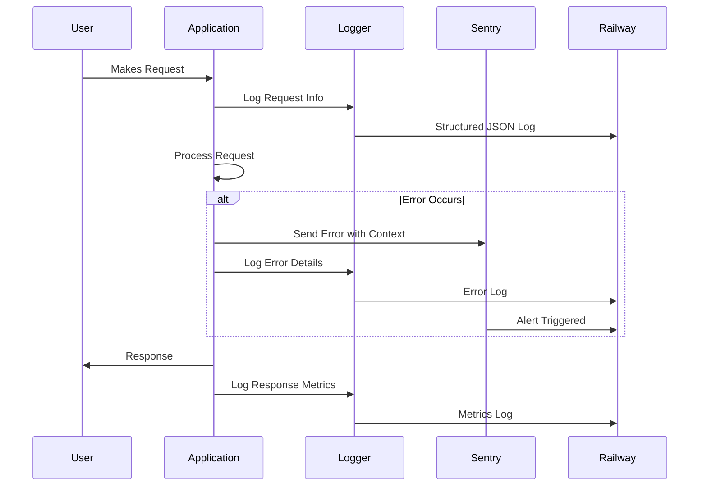

# Comprehensive Monitoring and Logging System Design for NedhubSMS

## Overview

This document outlines a comprehensive monitoring and logging system for the NedhubSMS platform, designed for compatibility with Railway deployment and providing robust error tracking, metrics collection, and alerting capabilities.

## Current State Analysis

### Existing Logging Patterns
- **Console-based logging**: Extensive use of `console.log()` and `console.error()` throughout the codebase
- **Structured logging**: Partial implementation in payment services using JSON.stringify() with labels
- **Error handling**: Basic try-catch blocks with console.error for stack traces
- **No centralized logging**: Logs scattered across services, controllers, and utilities

### Dependencies
- **Current**: Express, MongoDB (Mongoose), Redis (BullMQ), Axios
- **Missing**: Winston, Sentry, metrics collection libraries

### Railway Integration
- **railway.json**: Configured for Railway deployment
- **Log aggregation**: Railway provides built-in log viewing in dashboard
- **Alerting**: Railway supports basic alerting, external tools recommended for advanced monitoring

## Component Design

### 1. Structured Logging with Winston

#### Implementation Plan

**Package Dependencies:**
```json
{
  "winston": "^3.10.0",
  "winston-transport": "^4.5.0",
  "@sentry/node": "^7.73.0",
  "@sentry/profiling-node": "^1.2.0"
}
```

**Logger Configuration (backend/utils/logger.js):**
```javascript
const winston = require('winston');
const Sentry = require('@sentry/node');

const logFormat = winston.format.combine(
  winston.format.timestamp(),
  winston.format.errors({ stack: true }),
  winston.format.json()
);

const logger = winston.createLogger({
  level: process.env.LOG_LEVEL || 'info',
  format: logFormat,
  transports: [
    new winston.transports.Console({
      format: winston.format.combine(
        winston.format.colorize(),
        winston.format.simple()
      )
    }),
    new winston.transports.File({
      filename: 'logs/error.log',
      level: 'error'
    }),
    new winston.transports.File({
      filename: 'logs/combined.log'
    })
  ]
});

// Railway log aggregation - ensure JSON format for structured parsing
if (process.env.RAILWAY_ENVIRONMENT) {
  logger.add(new winston.transports.Console({
    format: logFormat
  }));
}

module.exports = logger;
```

**Migration Strategy:**
1. Replace `console.log()` with `logger.info()`
2. Replace `console.error()` with `logger.error()`
3. Add structured metadata (userId, requestId, etc.)
4. Update error handling middleware

**Railway Compatibility:**
- JSON format ensures Railway can parse and aggregate logs
- Separate error.log for Railway alerting rules
- Environment-specific log levels

### 2. Error Tracking with Sentry

#### Implementation Plan

**Sentry Configuration (backend/utils/sentry.js):**
```javascript
const Sentry = require('@sentry/node');
const { nodeProfilingIntegration } = require('@sentry/profiling-node');

Sentry.init({
  dsn: process.env.SENTRY_DSN,
  environment: process.env.RAILWAY_ENVIRONMENT || 'development',
  integrations: [
    new Sentry.httpIntegration({ tracing: true }),
    nodeProfilingIntegration(),
  ],
  tracesSampleRate: 1.0,
  profilesSampleRate: 1.0,
});

module.exports = Sentry;
```

**Error Middleware Enhancement (server/index.js):**
```javascript
const Sentry = require('./backend/utils/sentry');

// ... existing error middleware
app.use((err, req, res, next) => {
  Sentry.withScope((scope) => {
    scope.setUser({ id: req.user?.id });
    scope.setTag('url', req.url);
    scope.setTag('method', req.method);
    scope.setContext('request', {
      body: req.body,
      query: req.query,
      params: req.params
    });
    Sentry.captureException(err);
  });

  logger.error('Unhandled error', {
    error: err.message,
    stack: err.stack,
    url: req.url,
    method: req.method,
    userId: req.user?.id
  });

  res.status(500).json({ error: 'Something went wrong!' });
});
```

**Error Boundary Integration:**
- Wrap async route handlers with Sentry error capturing
- Add breadcrumbs for critical operations (payments, SMS sending)
- Capture performance metrics

### 3. Health Check Endpoints

#### Implementation Plan

**Health Route (backend/routes/health.js):**
```javascript
const express = require('express');
const router = express.Router();
const mongoose = require('mongoose');
const { Queue } = require('bullmq');

// Basic health check
router.get('/health', async (req, res) => {
  const health = {
    status: 'healthy',
    timestamp: new Date().toISOString(),
    uptime: process.uptime(),
    version: process.env.npm_package_version || '1.0.0'
  };

  try {
    // Database check
    await mongoose.connection.db.admin().ping();
    health.database = 'connected';
  } catch (error) {
    health.database = 'disconnected';
    health.status = 'unhealthy';
  }

  res.status(health.status === 'healthy' ? 200 : 503).json(health);
});

// Detailed health check
router.get('/health/detailed', async (req, res) => {
  const health = {
    status: 'healthy',
    services: {}
  };

  // Database
  try {
    await mongoose.connection.db.admin().ping();
    health.services.database = { status: 'up' };
  } catch (error) {
    health.services.database = { status: 'down', error: error.message };
    health.status = 'unhealthy';
  }

  // Redis/Queue
  try {
    const queue = new Queue('sms-queue', { connection: redisConfig });
    await queue.waitUntilReady();
    health.services.redis = { status: 'up' };
  } catch (error) {
    health.services.redis = { status: 'down', error: error.message };
    health.status = 'unhealthy';
  }

  // External services
  health.services.nalo = await checkNaloHealth();
  health.services.hubtel = await checkHubtelHealth();

  res.status(health.status === 'healthy' ? 200 : 503).json(health);
});

module.exports = router;
```

**Railway Integration:**
- Configure Railway health checks to monitor `/api/health`
- Set up alerting for unhealthy status

### 4. Metrics Collection System

#### Core Metrics Service (backend/services/MetricsService.js)

**Implementation:**
```javascript
const client = require('prom-client'); // If using Prometheus
// Or use a simple in-memory metrics store

class MetricsService {
  constructor() {
    this.metrics = {
      queueJobsProcessed: 0,
      queueJobsFailed: 0,
      apiRequestsTotal: 0,
      apiErrorsTotal: 0,
      paymentCallbacksReceived: 0,
      paymentCallbacksFailed: 0,
      smsDeliveryCallbacksReceived: 0,
      smsDeliveryCallbacksFailed: 0,
      smsSentTotal: 0,
      smsFailedTotal: 0
    };
  }

  // Queue worker metrics
  incrementQueueProcessed(campaignId) {
    this.metrics.queueJobsProcessed++;
    logger.info('Queue job processed', { campaignId, metric: 'queueJobsProcessed' });
  }

  incrementQueueFailed(campaignId, error) {
    this.metrics.queueJobsFailed++;
    logger.error('Queue job failed', { campaignId, error: error.message, metric: 'queueJobsFailed' });
  }

  // API metrics
  recordApiRequest(endpoint, method, statusCode) {
    this.metrics.apiRequestsTotal++;
    if (statusCode >= 400) {
      this.metrics.apiErrorsTotal++;
      logger.warn('API error', { endpoint, method, statusCode, metric: 'apiErrors' });
    }
  }

  // Payment callback metrics
  recordPaymentCallback(clientReference, success) {
    this.metrics.paymentCallbacksReceived++;
    if (!success) {
      this.metrics.paymentCallbacksFailed++;
      logger.error('Payment callback failed', { clientReference, metric: 'paymentCallbacksFailed' });
    } else {
      logger.info('Payment callback processed', { clientReference, metric: 'paymentCallbacksReceived' });
    }
  }

  // SMS delivery callback metrics
  recordSmsDeliveryCallback(messageId, status) {
    this.metrics.smsDeliveryCallbacksReceived++;
    if (status === 'failed') {
      this.metrics.smsDeliveryCallbacksFailed++;
      logger.error('SMS delivery failed', { messageId, status, metric: 'smsDeliveryCallbacksFailed' });
    } else {
      logger.info('SMS delivery status updated', { messageId, status, metric: 'smsDeliveryCallbacksReceived' });
    }
  }

  // SMS sending metrics
  recordSmsSent(recipientCount, success) {
    this.metrics.smsSentTotal += recipientCount;
    if (!success) {
      this.metrics.smsFailedTotal += recipientCount;
    }
  }

  getMetrics() {
    return { ...this.metrics };
  }
}

module.exports = new MetricsService();
```

#### Metrics Endpoint (backend/routes/metrics.js):
```javascript
const express = require('express');
const router = express.Router();
const MetricsService = require('../services/MetricsService');

router.get('/metrics', (req, res) => {
  const metrics = MetricsService.getMetrics();
  res.json(metrics);
});

module.exports = router;
```

### 5. Railway Deployment Integration

#### Log Aggregation
- Configure Winston to output JSON logs for Railway parsing
- Set up log levels: error, warn, info
- Use Railway's log search and filtering

#### Alerting Setup
```javascript
// backend/utils/alerting.js
const logger = require('./logger');

class AlertingService {
  async alertCriticalError(message, context) {
    logger.error('CRITICAL ALERT', { message, context, alert: true });
    // Railway will pick up error logs for alerting
  }

  async alertQueueFailure(campaignId, error) {
    logger.error('QUEUE FAILURE ALERT', {
      campaignId,
      error: error.message,
      alert: true,
      type: 'queue_failure'
    });
  }

  async alertPaymentFailure(clientReference, amount) {
    logger.error('PAYMENT FAILURE ALERT', {
      clientReference,
      amount,
      alert: true,
      type: 'payment_failure'
    });
  }
}

module.exports = new AlertingService();
```

#### Railway Configuration (railway.json):
```json
{
  "build": {
    "builder": "NIXPACKS"
  },
  "deploy": {
    "healthcheckPath": "/api/health",
    "healthcheckTimeout": 300,
    "restartPolicyType": "ON_FAILURE",
    "restartPolicyMaxRetries": 10
  }
}
```

## Implementation Roadmap

### Phase 1: Core Infrastructure (Week 1)
1. Install Winston and Sentry dependencies
2. Create logger utility with Winston configuration
3. Set up Sentry error tracking
4. Implement basic health check endpoints
5. Configure Railway health checks

### Phase 2: Logging Migration (Week 2)
1. Replace console.log/error in core services (auth, payments, SMS)
2. Add structured logging with metadata
3. Implement error boundaries with Sentry
4. Test log aggregation in Railway

### Phase 3: Metrics Collection (Week 3)
1. Implement MetricsService
2. Add metrics recording to queue workers
3. Add API request/response metrics
4. Add payment and SMS callback metrics
5. Create metrics dashboard endpoint

### Phase 4: Advanced Monitoring (Week 4)
1. Set up alerting rules in Railway
2. Implement performance monitoring
3. Add database health checks
4. Configure log retention policies
5. Documentation and training

## Success Metrics

- **Error tracking**: 100% of errors captured with full context
- **Log aggregation**: All logs structured and searchable in Railway
- **Health monitoring**: <1 minute detection of service failures
- **Metrics coverage**: Track all critical business operations
- **Alert response**: <5 minutes average alert response time

## Cost Considerations

- **Sentry**: Free tier covers basic error tracking
- **Railway**: Monitoring included in hosting costs
- **Additional tools**: Consider Prometheus/Grafana for advanced metrics if needed

## Security Considerations

- Sanitize sensitive data in logs (API keys, passwords)
- Use appropriate log levels to avoid information leakage
- Configure Sentry to exclude sensitive environment variables
- Implement log rotation to prevent disk space issues

## Mermaid Diagrams





This comprehensive monitoring system will provide robust observability for the NedhubSMS platform, ensuring reliable operation and quick issue resolution in the Railway deployment environment.