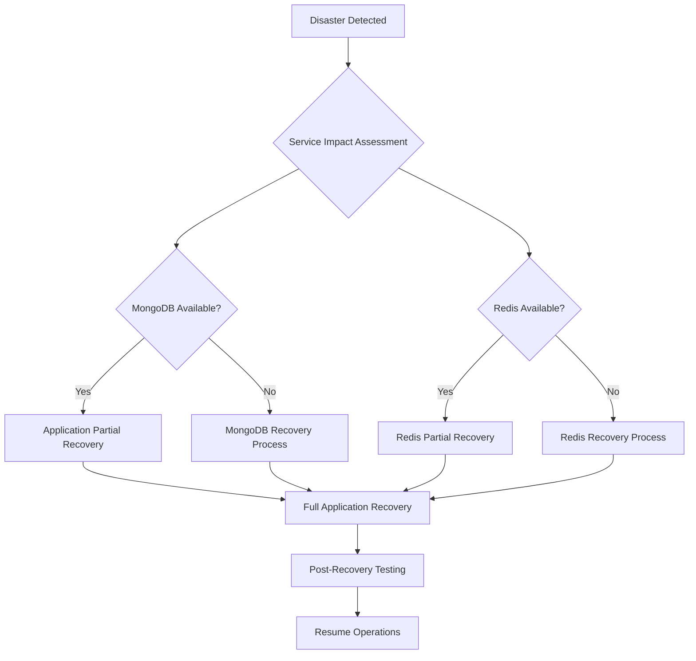

# Comprehensive Backup and Recovery Guidance for MongoDB and Redis on Railway

## Overview

This document provides comprehensive guidance for backing up and recovering MongoDB and Redis operational data in the Nedhub SMS application deployed on Railway. It covers Railway-specific strategies, automated schedules, point-in-time recovery, disaster recovery plans, testing protocols, and cost optimization.

## Current Deployment Configuration

### MongoDB
- **Connection**: Managed Railway MongoDB instance
- **URI**: Configured via `MONGODB_URI` environment variable
- **Usage**: Stores user data, SMS messages, campaigns, payments, financial summaries, and audit logs

### Redis
- **Connection**: Managed Railway Redis instance
- **Configuration**: AOF persistence with `appendfsync everysec` and RDB snapshots
- **Usage**: BullMQ job queues for SMS campaign processing
- **Persistence**: Enabled as per `REDIS_PERSISTENCE_CONFIGURATION.md`

## Railway-Specific Backup Strategies

### MongoDB Backup Strategies

Railway provides built-in backup capabilities for MongoDB:

#### 1. Automated Daily Backups
- **Frequency**: Daily automatic backups
- **Retention**: 7 days (free tier) or extended based on plan
- **Scope**: Full database snapshots
- **Trigger**: Automatic, no manual intervention required

#### 2. Point-in-Time Recovery
- **Granularity**: Up to the second
- **Window**: Up to 7 days (configurable based on plan)
- **Use Case**: Recovery from accidental data deletion or corruption

#### 3. Manual Snapshots
- **Trigger**: On-demand via Railway dashboard
- **Retention**: Manual management required
- **Use Case**: Before major deployments or data migrations

### Redis Backup Strategies

Building on the persistence configuration in `REDIS_PERSISTENCE_CONFIGURATION.md`:

#### 1. Automatic Backups
- **Frequency**: Plan-dependent (typically daily)
- **Method**: Leverages AOF and RDB persistence files
- **Retention**: Based on Railway plan
- **Scope**: Full Redis dataset including job queues

#### 2. Persistence-Based Recovery
- **AOF Recovery**: Append-only file for point-in-time recovery
- **RDB Snapshots**: Compressed point-in-time backups
- **Hybrid Approach**: Combines durability of AOF with speed of RDB

#### 3. Manual Exports
- **Method**: `redis-cli --rdb` for RDB dumps
- **Use Case**: Development testing or external storage

## Automated Backup Schedules

### Criticality-Based Scheduling

| Data Type | Frequency | Retention | Justification |
|-----------|-----------|-----------|--------------|
| User Authentication Data | Daily | 30 days | High criticality, compliance requirements |
| Financial Transactions | Hourly | 90 days | Regulatory compliance, audit trails |
| SMS Message Logs | Daily | 30 days | Operational data, debugging needs |
| Campaign Data | Daily | 60 days | Business continuity |
| Redis Job Queues | Every 4 hours | 7 days | Operational continuity |
| Audit Logs | Daily | 1 year | Compliance and security |

### Implementation via Railway

```bash
# Railway CLI for backup configuration (if supported)
railway variables set BACKUP_FREQUENCY=daily
railway variables set BACKUP_RETENTION_DAYS=30
```

## Point-in-Time Recovery Procedures

### MongoDB Point-in-Time Recovery

1. **Access Railway Dashboard**
   - Navigate to MongoDB service
   - Select "Backups" tab

2. **Select Recovery Point**
   - Choose specific timestamp within retention window
   - Review data impact assessment

3. **Initiate Recovery**
   ```bash
   # Via Railway CLI (if available)
   railway mongodb restore --timestamp "2024-01-01T12:00:00Z"
   ```

4. **Validation Steps**
   - Verify data integrity
   - Test application functionality
   - Check data consistency

### Redis Point-in-Time Recovery

1. **Stop Application Services**
   - Pause SMS processing to prevent new jobs

2. **Restore from Backup**
   - Use Railway dashboard to select backup
   - Choose point-in-time within AOF window

3. **Restart Services**
   - Resume application
   - Monitor queue recovery

4. **Validate Queue Integrity**
   ```bash
   # Check queue status
   redis-cli KEYS "bull:*" | wc -l
   ```

## Disaster Recovery Plans

### Disaster Recovery Workflow



### Regional Failover Strategy

1. **Primary Region Failure**
   - Automatic failover (if configured)
   - Manual region switch via Railway

2. **Data Recovery Priority**
   - User authentication first
   - Financial data second
   - Operational data third

3. **Communication Plan**
   - Internal team notification
   - User communication templates
   - Status page updates

### Recovery Time Objectives (RTO) and Recovery Point Objectives (RPO)

| Component | RTO | RPO | Justification |
|-----------|-----|-----|--------------|
| MongoDB | 4 hours | 1 hour | Financial data criticality |
| Redis | 1 hour | 15 minutes | Job queue continuity |
| Full Application | 6 hours | 1 hour | End-to-end service availability |

## Data Restoration Testing Protocols

### Testing Framework

#### 1. Environment Setup
- Create isolated staging environment
- Mirror production data structure
- Configure test Railway services

#### 2. Test Scenarios
- Full database restoration
- Point-in-time recovery
- Partial data restoration
- Cross-region recovery

#### 3. Validation Checklist
- [ ] Database connectivity established
- [ ] Data integrity verified (checksums, counts)
- [ ] Application services start successfully
- [ ] Core functionality tested
- [ ] Performance benchmarks met
- [ ] User data accessible
- [ ] Audit logs intact

### Automated Testing Script

```bash
#!/bin/bash
# backup-recovery-test.sh

echo "Starting backup recovery test..."

# 1. Create test data
mongosh $MONGODB_URI --eval "db.test_collection.insertOne({test: 'data', timestamp: new Date()})"

# 2. Simulate backup (Railway automated)
echo "Waiting for automated backup..."

# 3. Delete test data
mongosh $MONGODB_URI --eval "db.test_collection.deleteMany({})"

# 4. Restore from backup
# (Manual process via Railway dashboard)

# 5. Validate restoration
RECORDS=$(mongosh $MONGODB_URI --eval "db.test_collection.countDocuments({})" --quiet)
if [ "$RECORDS" -gt 0 ]; then
    echo "✓ Restoration successful"
else
    echo "✗ Restoration failed"
    exit 1
fi
```

### Quarterly Testing Schedule

- **Month 1**: Full disaster recovery simulation
- **Month 2**: Point-in-time recovery testing
- **Month 3**: Partial data restoration drills

## Backup Frequency Recommendations

### Data Classification Matrix

| Data Category | Business Impact | Backup Frequency | Retention Period |
|---------------|-----------------|------------------|------------------|
| Critical (Financial) | High | Hourly | 7 years (compliance) |
| Important (User Data) | High | Daily | 3 years |
| Operational (Logs) | Medium | Daily | 1 year |
| Transient (Cache) | Low | Weekly | 30 days |

### Frequency Adjustment Guidelines

- **Scale with Data Volume**: Increase frequency as database grows
- **Business Cycles**: More frequent during peak SMS campaign periods
- **Compliance Requirements**: Align with industry regulations (PCI, GDPR)
- **Cost Considerations**: Balance recovery needs with storage costs

## Retention Policies

### Tiered Retention Strategy

#### Hot Storage (Immediate Access)
- **Duration**: 30 days
- **Purpose**: Operational recovery
- **Storage**: Primary Railway backups

#### Warm Storage (Delayed Access)
- **Duration**: 90 days to 1 year
- **Purpose**: Compliance and audit
- **Storage**: Railway extended retention or external

#### Cold Storage (Archival)
- **Duration**: 1-7 years
- **Purpose**: Long-term compliance
- **Storage**: External archival solutions

### Retention Policy Rules

1. **Automatic Deletion**: Expired backups removed automatically
2. **Manual Preservation**: Critical backups flagged for retention
3. **Compliance Overrides**: Legal holds extend retention
4. **Cost Monitoring**: Regular review of storage utilization

## Cost Optimization for Railway Deployment

### Storage Cost Analysis

| Backup Type | Frequency | Estimated Monthly Cost | Optimization |
|-------------|-----------|----------------------|--------------|
| MongoDB Daily | Daily | $5-15 | Use compression, monitor growth |
| Redis Backups | Daily | $2-8 | Leverage AOF efficiency |
| Point-in-Time | Continuous | $10-25 | Set appropriate retention windows |

### Optimization Strategies

#### 1. Compression and Deduplication
```bash
# MongoDB compression settings
mongosh $MONGODB_URI --eval "db.adminCommand({setParameter: 1, wiredTigerMaxCacheOverflowSizeGB: 1})"
```

#### 2. Selective Backup Policies
- Exclude development/test data from production backups
- Implement table/collection-level backup controls
- Use incremental backups where supported

#### 3. Retention Optimization
- Implement automatic cleanup policies
- Archive old data to cheaper storage
- Regular audit of backup necessity

#### 4. Monitoring and Alerts
- Set storage usage thresholds
- Monitor backup success rates
- Alert on cost overruns

### Cost-Benefit Analysis Framework

Regularly evaluate:
- Recovery time vs. backup frequency cost
- Storage cost vs. data retention value
- Automation benefits vs. manual process costs

## Monitoring and Alerting

### Key Metrics to Monitor

#### Backup Health
- Backup completion status
- Backup duration trends
- Storage utilization

#### Recovery Readiness
- Backup restoration success rate
- Point-in-time recovery window
- Data consistency checks

### Alert Configuration

```javascript
// Example alerting setup
const alerts = {
  backupFailure: {
    condition: 'backup_status == "failed"',
    severity: 'critical',
    notification: 'immediate'
  },
  storageThreshold: {
    condition: 'storage_used > 80%',
    severity: 'warning',
    notification: 'daily'
  }
};
```

## Conclusion

This comprehensive backup and recovery strategy ensures the Nedhub SMS application's data durability and business continuity on Railway. Regular testing, monitoring, and optimization are crucial for maintaining effective backup practices.

## References

- [Railway Database Documentation](https://docs.railway.app/databases)
- [MongoDB Backup Methods](https://docs.mongodb.com/manual/core/backups/)
- [Redis Persistence](https://redis.io/docs/management/persistence/)
- [BullMQ Reliability](https://docs.bullmq.io/guide/reliability)