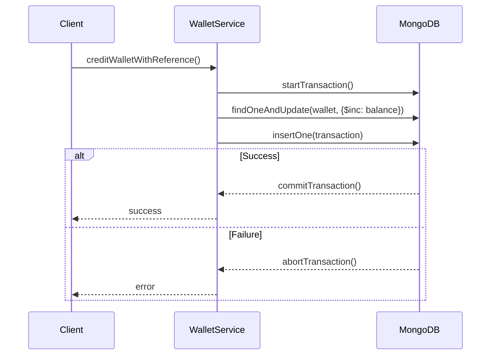
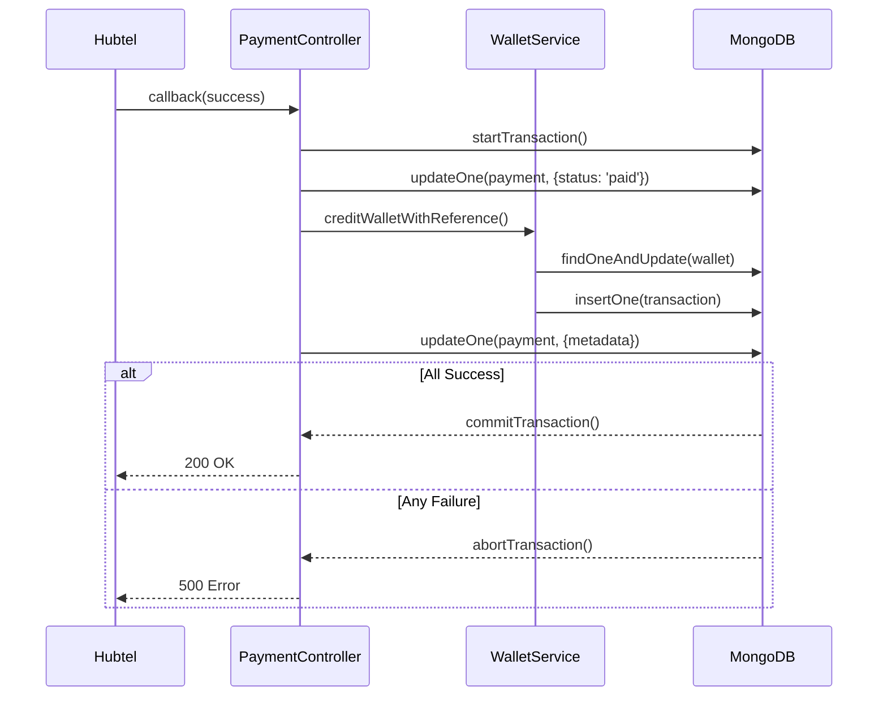
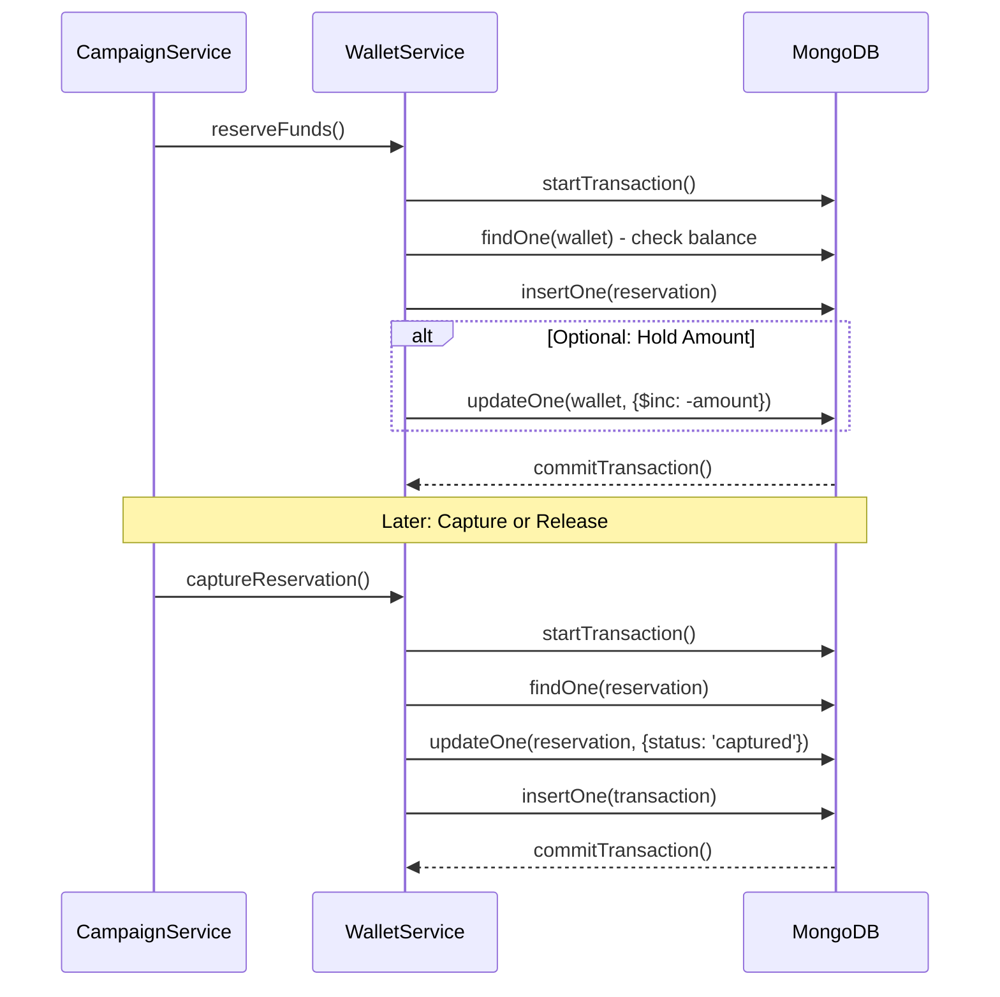

# MongoDB Consistency Improvements for Wallet Operations

## Current Issues Identified

### 1. Non-Atomic Operations in WalletService
- **Issue**: Wallet balance updates use `findOneAndUpdate` (atomic), but transaction record creation is separate
- **Risk**: If transaction save fails after wallet credit/debit, wallet is updated without audit trail
- **Location**: `WalletService._performCredit()` and `deductGhsForSms()`

### 2. Payment Processing Race Conditions
- **Issue**: Payment status updates, wallet credits, and transaction records are separate operations
- **Risk**: Duplicate callbacks could cause double-crediting if status check fails
- **Location**: `paymentController.handleHubtelCallback()` and `creditWalletIfNeeded()`

### 3. Missing Reservation Implementation
- **Issue**: Code calls `WalletService.reserveFunds()`, `captureReservation()`, `releaseReservation()` but these methods don't exist
- **Risk**: Reservation-based charging is broken, campaigns may fail unexpectedly
- **Location**: Multiple files calling undefined methods

### 4. No Optimistic Locking
- **Issue**: No version fields to prevent concurrent modification conflicts
- **Risk**: Race conditions in high-concurrency scenarios

### 5. Inconsistent Error Handling
- **Issue**: Partial failures can leave system in inconsistent state
- **Risk**: Money lost or double-charged without proper rollback

## Proposed Improvements

### 1. Add Optimistic Locking to Wallet Model
```javascript
// Add to Wallet.js schema
version: {
  type: Number,
  default: 0
}

// Update pre-save hook
walletSchema.pre('save', function(next) {
  this.version += 1;
  this.updatedAt = Date.now();
  next();
});
```

### 2. Implement MongoDB Transactions
- Enable transactions for replica-set deployments
- Wrap multi-document operations in transactions
- Provide fallback for non-replica-set environments

### 3. Transaction Boundaries

#### Wallet Credit Operation
```
Transaction Boundary:
1. Check wallet exists/create if needed
2. Update wallet balance with version check
3. Create transaction record
4. Commit or rollback all
```

#### Wallet Debit Operation
```
Transaction Boundary:
1. Check balance >= amount with version
2. Update wallet balance
3. Create transaction record
4. Update usage counters
5. Commit or rollback all
```

#### Payment Processing
```
Transaction Boundary:
1. Update payment status
2. Credit wallet (nested transaction)
3. Update payment metadata
4. Commit or rollback all
```

#### Reservation Operations
```
Reserve Funds:
1. Check wallet balance
2. Create reservation record
3. Update wallet (hold amount)
4. Commit or rollback

Capture Reservation:
1. Find active reservation
2. Update reservation status
3. Create debit transaction
4. Commit or rollback

Release Reservation:
1. Find active reservation
2. Update reservation status
3. Credit wallet (return held amount)
4. Commit or rollback
```

### 4. Implement Missing Reservation Methods

#### `WalletService.reserveFunds(userId, amount, campaignId)`
```javascript
async reserveFunds(userId, amount, campaignId) {
  const session = await mongoose.startSession();
  session.startTransaction();

  try {
    // Check balance
    const wallet = await Wallet.findOne({ userId }).session(session);
    if (!wallet || wallet.balance < amount) {
      throw new Error('Insufficient balance');
    }

    // Create reservation
    const reservation = new WalletReservation({
      userId,
      campaignId,
      amount
    });
    await reservation.save({ session });

    // Optionally hold amount (debit wallet)
    // await Wallet.updateOne({ userId }, { $inc: { balance: -amount } }).session(session);

    await session.commitTransaction();
    return reservation;
  } catch (error) {
    await session.abortTransaction();
    throw error;
  } finally {
    session.endSession();
  }
}
```

#### `WalletService.captureReservation(reservationId)`
```javascript
async captureReservation(reservationId) {
  const session = await mongoose.startSession();
  session.startTransaction();

  try {
    const reservation = await WalletReservation.findById(reservationId).session(session);
    if (!reservation || reservation.status !== 'active') {
      throw new Error('Invalid reservation');
    }

    // Capture reservation
    reservation.status = 'captured';
    reservation.capturedAt = new Date();
    await reservation.save({ session });

    // Create transaction record
    const transaction = new Transaction({
      userId: reservation.userId,
      type: 'debit',
      amount: reservation.amount,
      description: `Campaign reservation capture`,
      reference: `RESERVATION-${reservationId}`,
      balanceBefore: 0, // Calculate from wallet
      balanceAfter: 0
    });
    await transaction.save({ session });

    await session.commitTransaction();
    return { reservation, transaction };
  } catch (error) {
    await session.abortTransaction();
    throw error;
  } finally {
    session.endSession();
  }
}
```

#### `WalletService.releaseReservation(reservationId)`
```javascript
async releaseReservation(reservationId) {
  const session = await mongoose.startSession();
  session.startTransaction();

  try {
    const reservation = await WalletReservation.findById(reservationId).session(session);
    if (!reservation || reservation.status !== 'active') {
      throw new Error('Invalid reservation');
    }

    reservation.status = 'released';
    reservation.releasedAt = new Date();
    await reservation.save({ session });

    await session.commitTransaction();
    return reservation;
  } catch (error) {
    await session.abortTransaction();
    throw error;
  } finally {
    session.endSession();
  }
}
```

### 5. Error Handling and Rollback Strategies

#### Transaction-Level Rollback
- Use MongoDB's automatic rollback on transaction failure
- Log all transaction failures with context
- Implement retry logic for transient failures

#### Application-Level Compensation
```javascript
class TransactionManager {
  async executeWithCompensation(operation, compensation) {
    try {
      const result = await operation();
      return result;
    } catch (error) {
      if (compensation) {
        await compensation(error);
      }
      throw error;
    }
  }
}
```

#### Idempotency Keys
- Use payment clientReference as idempotency key
- Store operation results in cache/database
- Prevent duplicate operations

### 6. Migration Strategy

#### Phase 1: Add Version Fields
- Add `version` field to Wallet schema
- Set initial version to 0 for existing records

#### Phase 2: Implement Transactions (Optional)
- Add transaction support where MongoDB allows
- Keep non-transaction fallback for single-instance deployments

#### Phase 3: Implement Reservations
- Add reservation methods
- Update campaign logic to handle reservations properly

#### Phase 4: Enhanced Error Handling
- Add comprehensive logging
- Implement monitoring alerts for failed operations

## Implementation Priority

1. **High**: Fix missing reservation methods (blocking functionality)
2. **High**: Add atomic wallet + transaction operations
3. **Medium**: Add optimistic locking
4. **Medium**: Transaction support for multi-document ops
5. **Low**: Advanced compensation logic

## Transaction Flow Diagrams

### Wallet Credit Operation


### Payment Processing Flow


### Reservation Flow


## Testing Strategy

- Unit tests for each operation with transaction mocks
- Integration tests with real MongoDB transactions
- Load testing for concurrency scenarios
- Chaos testing for network failures during operations